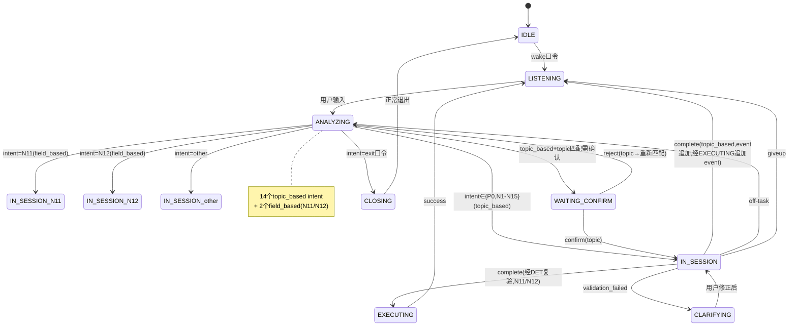

# L2-N4 状态转移图与路由表（v5.8）

**项目**：元智能体（MetaAgent）
**基线**：态控架构 v5.8 / N4节点说明 v6.0
**日期**：2026-07-20

---

## 一、状态转移图

---

## 二、转移边列表（核心）

| from | to | pathType | taskType | topicEv | trigger |
|------|-----|----------|----------|:---:|---------|
| IDLE | LISTENING | optimal_path | N/A | false | wake口令 |
| LISTENING | ANALYZING | optimal_path | N/A | false | 用户输入 |
| ANALYZING | IN_SESSION(P0-N15) | optimal_path | topic/fd | - | intent=P0~N15 |
| ANALYZING | IN_SESSION(other) | optimal_path | topic | false | intent=other |
| **ANALYZING** | **WAITING_CONFIRM** | **confirm_path** | **topic** | **false** | **topic匹配需确认** |
| ANALYZING | CLOSING | exit_path | N/A | false | exit口令 |
| IN_SESSION(topic) | LISTENING | optimal_path | topic | **true** | complete+追加event |
| IN_SESSION(field) | EXECUTING | optimal_path | field | false | complete(N11/N12) |
| IN_SESSION | CLARIFYING | validation_failed | - | false | validation_failed |
| IN_SESSION | ANALYZING | off_task_path | - | **true** | off-task+追加event |
| IN_SESSION | LISTENING | giveup_path | - | **true** | giveup+追加event |
| WAITING_CONFIRM | IN_SESSION | confirm_path | topic | false | confirm |
| WAITING_CONFIRM | ANALYZING | confirm_path | topic | false | reject→重新匹配 |
| CLARIFYING | IN_SESSION | optimal_path | - | false | 用户修正 |
| EXECUTING | LISTENING | optimal_path | field | false | success |
| CLOSING | IDLE | exit_path | N/A | false | 正常退出 |
| 任意 | ANALYZING | optimal_path | N/A | false | switch口令(S3) |
| 任意 | LISTENING | optimal_path | N/A | false | cancel口令 |

---

## 三、路由表（核心条目）

| fromState | contractOutKey | toState | modelHint | topicEv | validationType |
|-----------|---------------|---------|-----------|:---:|---------------|
| ANALYZING | intent=P0~N10(topic) | IN_SESSION | 通用模型 | false | — |
| ANALYZING | intent=N11 | IN_SESSION(N11) | 通用模型 | false | — |
| ANALYZING | intent=N12 | IN_SESSION(N12) | 通用模型 | false | — |
| **ANALYZING** | **intent=N13** | **IN_SESSION(N13)** | **代码专项模型** | **false** | **—** |
| ANALYZING | intent=N14~N15(topic) | IN_SESSION | 通用模型 | false | — |
| **ANALYZING** | **topic匹配成功** | **WAITING_CONFIRM** | **null** | **false** | **—** |
| IN_SESSION(topic) | turnType=complete | LISTENING | null | **true** | output_format |
| IN_SESSION(N11/N12) | turnType=complete | EXECUTING | null | false | value_domain |
| IN_SESSION | turnType=off-task | ANALYZING | null | **true** | — |
| IN_SESSION | turnType=giveup | LISTENING | null | **true** | — |
| WAITING_CONFIRM | decision=confirm | IN_SESSION | 通用模型 | false | — |
| WAITING_CONFIRM | decision=reject | ANALYZING | null | false | — |

**两层模型选择**：
- 第一层：ANALYZING→DeepSeek轻量 / IN_SESSION→DeepSeek通用
- 第二层：IN_SESSION(N13)→代码专项模型

---

## 四、topicEvolution 转移边专项

| from | to | topicEv | stateSnapshot |
|------|-----|:---:|--------------|
| IN_SESSION(topic) | LISTENING | ✅ | checkpoint |
| IN_SESSION(topic) | ANALYZING(off-task) | ✅ | active |
| IN_SESSION(topic) | LISTENING(giveup) | ✅ | abandoned |

---

## 五、降级链四项

| 检查 | 执行体 | field_based | topic_based | 失败路由 |
|------|--------|------------|------------|---------|
| L1结构 | DET | JSON.parse | JSON.parse+格式检查 | 重试1次→熔断 |
| DET值域 | DET | 值域校验(N11/N12) | 输出格式校验 | CLARIFYING |
| logprobs | DET | 阈值+词表 | 同左 | CLARIFYING(冷启动软拦截) |
| 硬编码 | DET | 硬编码回复 | 同左 | LISTENING |
