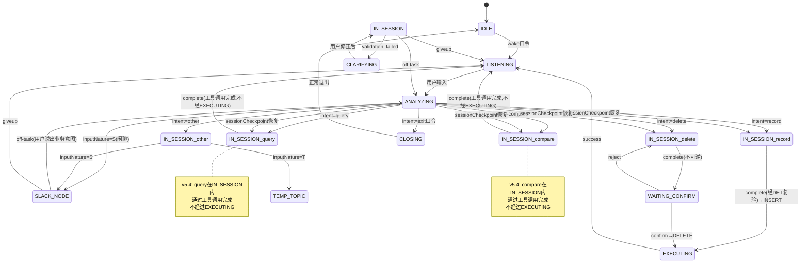

# L2-N4 状态转移图与路由表（v5.6）

**项目**：富贵小安
**基线**：态控架构 v5.6 / N4节点说明 v6.0 / N4环节宪法 v1.6
**日期**：2026-07-18

---

## 一、状态转移图（Mermaid）



---

## 二、转移边列表（JSON）

```json
[
  { "transitionId": "N4_T001", "fromState": "IDLE", "toState": "LISTENING", "pathType": "optimal_path", "taskType": "N/A", "topicEvolutionEventAppended": false, "triggerCondition": "wake口令 EXACT_MATCH", "routeRule": "hard_match", "modelOverride": null, "modelHint": null, "note": "M1 wake口令" },
  { "transitionId": "N4_T002", "fromState": "LISTENING", "toState": "ANALYZING", "pathType": "optimal_path", "taskType": "N/A", "topicEvolutionEventAppended": false, "triggerCondition": "用户输入", "routeRule": "hard_match", "modelOverride": null, "modelHint": null },
  { "transitionId": "N4_T003", "fromState": "ANALYZING", "toState": "IN_SESSION(record)", "pathType": "optimal_path", "taskType": "field_based", "topicEvolutionEventAppended": false, "triggerCondition": "intent=record AND probability>=0.7", "routeRule": "hard_match", "modelOverride": null, "modelHint": "通用模型即可" },
  { "transitionId": "N4_T004", "fromState": "ANALYZING", "toState": "IN_SESSION(query)", "pathType": "optimal_path", "taskType": "field_based", "topicEvolutionEventAppended": false, "triggerCondition": "intent=query AND probability>=0.7", "routeRule": "hard_match", "modelOverride": null, "modelHint": "通用模型即可" },
  { "transitionId": "N4_T005", "fromState": "ANALYZING", "toState": "IN_SESSION(delete)", "pathType": "optimal_path", "taskType": "field_based", "topicEvolutionEventAppended": false, "triggerCondition": "intent=delete AND probability>=0.7", "routeRule": "hard_match", "modelOverride": null, "modelHint": "通用模型即可" },
  { "transitionId": "N4_T006", "fromState": "ANALYZING", "toState": "IN_SESSION(compare)", "pathType": "optimal_path", "taskType": "field_based", "topicEvolutionEventAppended": false, "triggerCondition": "intent=compare AND probability>=0.7", "routeRule": "hard_match", "modelOverride": null, "modelHint": "通用模型即可" },
  { "transitionId": "N4_T007", "fromState": "ANALYZING", "toState": "IN_SESSION(other)", "pathType": "optimal_path", "taskType": "field_based", "topicEvolutionEventAppended": false, "triggerCondition": "intent=other", "routeRule": "hard_match", "modelOverride": null, "modelHint": "通用模型即可", "note": "架构自动路由 S→SLACK_NODE/T→TEMP_TOPIC/U→追问" },
  { "transitionId": "N4_T008", "fromState": "ANALYZING", "toState": "SLACK_NODE", "pathType": "chitchat_path", "taskType": "N/A", "topicEvolutionEventAppended": false, "triggerCondition": "inputNature=S(闲聊)", "routeRule": "hard_match", "modelOverride": null, "modelHint": "通用模型即可" },
  { "transitionId": "N4_T009", "fromState": "ANALYZING", "toState": "CLOSING", "pathType": "exit_path", "taskType": "N/A", "topicEvolutionEventAppended": false, "triggerCondition": "exit口令 EXACT_MATCH", "routeRule": "hard_match", "modelOverride": null, "modelHint": null, "note": "M1 exit口令" },

  { "transitionId": "N4_T010", "fromState": "ANALYZING", "toState": "IN_SESSION(record)", "pathType": "optimal_path", "taskType": "field_based", "topicEvolutionEventAppended": false, "triggerCondition": "sessionCheckpoint恢复: lastCompletedStep含record", "routeRule": "hard_match", "modelOverride": null, "modelHint": "通用模型即可", "note": "sessionCheckpoint恢复路径" },
  { "transitionId": "N4_T011", "fromState": "ANALYZING", "toState": "IN_SESSION(query)", "pathType": "optimal_path", "taskType": "field_based", "topicEvolutionEventAppended": false, "triggerCondition": "sessionCheckpoint恢复: lastCompletedStep含query", "routeRule": "hard_match", "modelOverride": null, "modelHint": "通用模型即可", "note": "sessionCheckpoint恢复路径" },
  { "transitionId": "N4_T012", "fromState": "ANALYZING", "toState": "IN_SESSION(delete)", "pathType": "optimal_path", "taskType": "field_based", "topicEvolutionEventAppended": false, "triggerCondition": "sessionCheckpoint恢复: lastCompletedStep含delete", "routeRule": "hard_match", "modelOverride": null, "modelHint": "通用模型即可", "note": "sessionCheckpoint恢复路径" },
  { "transitionId": "N4_T013", "fromState": "ANALYZING", "toState": "IN_SESSION(compare)", "pathType": "optimal_path", "taskType": "field_based", "topicEvolutionEventAppended": false, "triggerCondition": "sessionCheckpoint恢复: lastCompletedStep含compare", "routeRule": "hard_match", "modelOverride": null, "modelHint": "通用模型即可", "note": "sessionCheckpoint恢复路径" },

  { "transitionId": "N4_T014", "fromState": "ANALYZING", "toState": "IN_SESSION(query)", "pathType": "soft_landing_path", "taskType": "field_based", "topicEvolutionEventAppended": false, "triggerCondition": "软着陆: 推荐理财→query", "routeRule": "hard_match", "modelOverride": null, "modelHint": "通用模型即可" },
  { "transitionId": "N4_T015", "fromState": "ANALYZING", "toState": "IN_SESSION(other)", "pathType": "soft_landing_path", "taskType": "field_based", "topicEvolutionEventAppended": false, "triggerCondition": "软着陆: 闲聊→other→SLACK_NODE", "routeRule": "hard_match", "modelOverride": null, "modelHint": "通用模型即可" },
  { "transitionId": "N4_T016", "fromState": "ANALYZING", "toState": "IN_SESSION(other)", "pathType": "soft_landing_path", "taskType": "field_based", "topicEvolutionEventAppended": false, "triggerCondition": "软着陆: 非记账问题→other→TEMP_TOPIC", "routeRule": "hard_match", "modelOverride": null, "modelHint": "通用模型即可" },

  { "transitionId": "N4_T020", "fromState": "IN_SESSION(record)", "toState": "EXECUTING", "pathType": "optimal_path", "taskType": "field_based", "topicEvolutionEventAppended": false, "triggerCondition": "turnType=complete(经DET复验)", "routeRule": "hard_match", "modelOverride": null, "modelHint": null, "validationType": "value_domain", "note": "v5.4: record走EXECUTING(INSERT)" },
  { "transitionId": "N4_T021", "fromState": "IN_SESSION(query)", "toState": "LISTENING", "pathType": "optimal_path", "taskType": "field_based", "topicEvolutionEventAppended": false, "triggerCondition": "turnType=complete(工具调用完成)", "routeRule": "hard_match", "modelOverride": null, "modelHint": null, "note": "v5.4: query不走EXECUTING,在IN_SESSION内通过工具调用完成" },
  { "transitionId": "N4_T022", "fromState": "IN_SESSION(delete)", "toState": "WAITING_CONFIRM", "pathType": "confirm_path", "taskType": "field_based", "topicEvolutionEventAppended": false, "triggerCondition": "turnType=complete(不可逆操作)", "routeRule": "hard_match", "modelOverride": null, "modelHint": null, "note": "delete不可逆→人确认" },
  { "transitionId": "N4_T023", "fromState": "IN_SESSION(compare)", "toState": "LISTENING", "pathType": "optimal_path", "taskType": "field_based", "topicEvolutionEventAppended": false, "triggerCondition": "turnType=complete(工具调用完成)", "routeRule": "hard_match", "modelOverride": null, "modelHint": null, "note": "v5.4: compare不走EXECUTING,在IN_SESSION内通过工具调用完成" },

  { "transitionId": "N4_T030", "fromState": "IN_SESSION", "toState": "CLARIFYING", "pathType": "validation_failed_path", "taskType": "field_based", "topicEvolutionEventAppended": false, "triggerCondition": "turnType=validation_failed", "routeRule": "hard_match", "modelOverride": null, "modelHint": null, "validationType": "value_domain" },
  { "transitionId": "N4_T031", "fromState": "IN_SESSION", "toState": "ANALYZING", "pathType": "off_task_path", "taskType": "field_based", "topicEvolutionEventAppended": false, "triggerCondition": "turnType=off-task", "routeRule": "hard_match", "modelOverride": null, "modelHint": null, "note": "off-task→ANALYZING重新识别" },
  { "transitionId": "N4_T032", "fromState": "IN_SESSION", "toState": "LISTENING", "pathType": "giveup_path", "taskType": "field_based", "topicEvolutionEventAppended": false, "triggerCondition": "turnType=giveup", "routeRule": "hard_match", "modelOverride": null, "modelHint": null },
  { "transitionId": "N4_T033", "fromState": "IN_SESSION", "toState": "IN_SESSION", "pathType": "optimal_path", "taskType": "field_based", "topicEvolutionEventAppended": false, "triggerCondition": "turnType=ask/reply", "routeRule": "hard_match", "modelOverride": null, "modelHint": null, "note": "继续环节内对话" },

  { "transitionId": "N4_T040", "fromState": "CLARIFYING", "toState": "IN_SESSION", "pathType": "optimal_path", "taskType": "field_based", "topicEvolutionEventAppended": false, "triggerCondition": "用户修正后", "routeRule": "hard_match", "modelOverride": null, "modelHint": null, "note": "复用模型message,0次LLM" },

  { "transitionId": "N4_T050", "fromState": "WAITING_CONFIRM", "toState": "EXECUTING", "pathType": "confirm_path", "taskType": "field_based", "topicEvolutionEventAppended": false, "triggerCondition": "decision=confirm", "routeRule": "hard_match", "modelOverride": null, "modelHint": null, "note": "确认删除→EXECUTING(DELETE)" },
  { "transitionId": "N4_T051", "fromState": "WAITING_CONFIRM", "toState": "IN_SESSION(delete)", "pathType": "confirm_path", "taskType": "field_based", "topicEvolutionEventAppended": false, "triggerCondition": "decision=reject", "routeRule": "hard_match", "modelOverride": null, "modelHint": null, "note": "拒绝删除→回到delete环节" },

  { "transitionId": "N4_T060", "fromState": "EXECUTING", "toState": "LISTENING", "pathType": "optimal_path", "taskType": "field_based", "topicEvolutionEventAppended": false, "triggerCondition": "status=success", "routeRule": "hard_match", "modelOverride": null, "modelHint": null },

  { "transitionId": "N4_T070", "fromState": "CLOSING", "toState": "IDLE", "pathType": "exit_path", "taskType": "N/A", "topicEvolutionEventAppended": false, "triggerCondition": "正常退出", "routeRule": "hard_match", "modelOverride": null, "modelHint": null },

  { "transitionId": "N4_T080", "fromState": "SLACK_NODE", "toState": "ANALYZING", "pathType": "off_task_path", "taskType": "N/A", "topicEvolutionEventAppended": false, "triggerCondition": "用户说出业务意图(off-task)", "routeRule": "hard_match", "modelOverride": null, "modelHint": null, "note": "松弛节点→收敛节点转换,probability>=0.7守卫" },
  { "transitionId": "N4_T081", "fromState": "SLACK_NODE", "toState": "LISTENING", "pathType": "giveup_path", "taskType": "N/A", "topicEvolutionEventAppended": false, "triggerCondition": "giveup", "routeRule": "hard_match", "modelOverride": null, "modelHint": null },

  { "transitionId": "N4_T090", "fromState": "任意状态", "toState": "ANALYZING", "pathType": "optimal_path", "taskType": "N/A", "topicEvolutionEventAppended": false, "triggerCondition": "switch口令'切断房间' EXACT_MATCH", "routeRule": "hard_match", "modelOverride": null, "modelHint": null, "note": "M1 switch口令(架构级),触发S3物理隔离+roomStateIndex注入" },
  { "transitionId": "N4_T091", "fromState": "任意状态", "toState": "LISTENING", "pathType": "optimal_path", "taskType": "N/A", "topicEvolutionEventAppended": false, "triggerCondition": "cancel口令 EXACT_MATCH", "routeRule": "hard_match", "modelOverride": null, "modelHint": null, "note": "M1 cancel口令(中断当前推理不归档)" }
]
```

---

## 三、路由表

| 当前状态 | contract-out关键字段 | 下一状态 | 路由规则 | modelHint | topicEvolutionEventAppended | expectsChangeLevel | validationType |
|---------|---------------------|---------|---------|-----------|---------------------------|-------------------|---------------|
| ANALYZING | intent=record | IN_SESSION(record) | 硬匹配 | 通用模型即可 | false | false | — |
| ANALYZING | intent=query | IN_SESSION(query) | 硬匹配 | 通用模型即可 | false | false | — |
| ANALYZING | intent=delete | IN_SESSION(delete) | 硬匹配 | 通用模型即可 | false | false | — |
| ANALYZING | intent=compare | IN_SESSION(compare) | 硬匹配 | 通用模型即可 | false | false | — |
| ANALYZING | intent=other | IN_SESSION(other) | 硬匹配 | 通用模型即可 | false | false | — |
| ANALYZING | inputNature=S | SLACK_NODE | 硬匹配 | 通用模型即可 | false | false | — |
| ANALYZING | intent=exit口令 | CLOSING | 硬匹配 | null | false | false | — |
| ANALYZING | 软着陆→query | IN_SESSION(query) | 硬匹配 | 通用模型即可 | false | false | — |
| ANALYZING | 软着陆→other | IN_SESSION(other) | 硬匹配 | 通用模型即可 | false | false | — |
| IN_SESSION(record) | turnType=complete | EXECUTING（经DET复验） | 硬匹配 | null | false | false | value_domain |
| IN_SESSION(query) | turnType=complete | LISTENING | 硬匹配 | null | false | false | — |
| IN_SESSION(delete) | turnType=complete | WAITING_CONFIRM | 硬匹配 | null | false | false | — |
| IN_SESSION(compare) | turnType=complete | LISTENING | 硬匹配 | null | false | false | — |
| IN_SESSION | turnType=validation_failed | CLARIFYING | 硬匹配 | null | false | false | value_domain |
| IN_SESSION | turnType=off-task | ANALYZING | 硬匹配 | null | false | false | — |
| IN_SESSION | turnType=giveup | LISTENING | 硬匹配 | null | false | false | — |
| IN_SESSION | turnType=ask/reply | IN_SESSION（继续） | 硬匹配 | null | false | false | — |
| CLARIFYING | — | IN_SESSION | 硬匹配 | null | false | false | — |
| WAITING_CONFIRM | decision=confirm | EXECUTING | 硬匹配 | null | false | false | — |
| WAITING_CONFIRM | decision=reject | IN_SESSION(delete) | 硬匹配 | null | false | false | — |
| EXECUTING | status=success | LISTENING | 硬匹配 | null | false | false | — |
| CLOSING | — | IDLE | 硬匹配 | null | false | false | — |
| SLACK_NODE | off-task(业务意图) | ANALYZING | 硬匹配 | null | false | false | — |
| SLACK_NODE | giveup | LISTENING | 硬匹配 | null | false | false | — |
| 任意状态 | switch口令 | ANALYZING | 硬匹配 | null | false | false | — |
| 任意状态 | cancel口令 | LISTENING | 硬匹配 | null | false | false | — |

**两层模型选择**：
- 第一层：ANALYZING→DeepSeek轻量 / IN_SESSION→DeepSeek通用
- 第二层：全 null（field_based 用默认通用模型，不需要专用模型）

---

## 四、降级链路由（四项检查）

| 检查项 | 执行体 | 触发条件 | field_based处理 | 失败路由 | 冷启动特殊处理 |
|--------|--------|---------|----------------|---------|--------------|
| L1结构校验 | DET | complete时 | JSON.parse+Schema校验 | 重试1次→熔断→硬编码回复 | 无 |
| DET值域复验 | DET | complete时 | 值域校验（金额/时间/必填字段） | CLARIFYING | 无 |
| logprobs检查 | DET | complete时 | probability<threshold + pattern扫词表 | CLARIFYING | 冷启动期软拦截/非冷启动期硬拦截 |
| 硬编码兜底 | DET | 熔断时 | 硬编码回复 | LISTENING | 无 |

---

## 五、覆盖检查

### 状态覆盖

| N3状态 | N4转移边覆盖 | 状态 |
|--------|------------|------|
| IDLE | N4_T001(入), N4_T070(入) | ✅ |
| LISTENING | N4_T002(入), N4_T021/023/032/060/081(入) | ✅ |
| ANALYZING | N4_T002(入), N4_T031/080(入) | ✅ |
| IN_SESSION | N4_T003-016(入), N4_T033(自循环) | ✅ |
| CLARIFYING | N4_T030(入), N4_T040(出) | ✅ |
| WAITING_CONFIRM | N4_T022(入), N4_T050/051(出) | ✅ |
| EXECUTING | N4_T020/050(入), N4_T060(出) | ✅ |
| CLOSING | N4_T009(入), N4_T070(出) | ✅ |
| SLACK_NODE | N4_T008(入), N4_T080/081(出) | ✅ |

### 路径覆盖

| pathType | 覆盖 | 转移边 |
|----------|------|--------|
| optimal_path | ✅ | N4_T001-007, 010-013, 020-023, 033, 040, 060 |
| validation_failed_path | ✅ | N4_T030 |
| off_task_path | ✅ | N4_T031, 080 |
| giveup_path | ✅ | N4_T032, 081 |
| confirm_path | ✅ | N4_T022, 050, 051 |
| exit_path | ✅ | N4_T009, 070 |
| chitchat_path | ✅ | N4_T008 |
| soft_landing_path | ✅ | N4_T014, 015, 016 |

---

## 六、v5.3 → v5.6 变化说明

| 变化点 | v5.3 | v5.6 |
|--------|------|------|
| query/compare 路由 | IN_SESSION→EXECUTING→LISTENING | **v5.4: IN_SESSION→LISTENING（工具调用完成，不经EXECUTING）** |
| M1口令 | wake/exit/cancel/switch | **wake/exit/cancel/switch + S3物理隔离 + roomStateIndex** |
| sessionCheckpoint恢复 | 仅record | **全部4个业务环节（record/query/delete/compare）** |
| 转移边格式 | 简单列表 | **完整JSON转移边（含transitionId/dispatchCriteria）** |
| 路由表 | 简单表格 | **含modelHint/topicEvolutionEventAppended/expectsChangeLevel/validationType** |
| 降级链 | 五项检查 | **四项检查（移除跨任务延伸检测）** |
